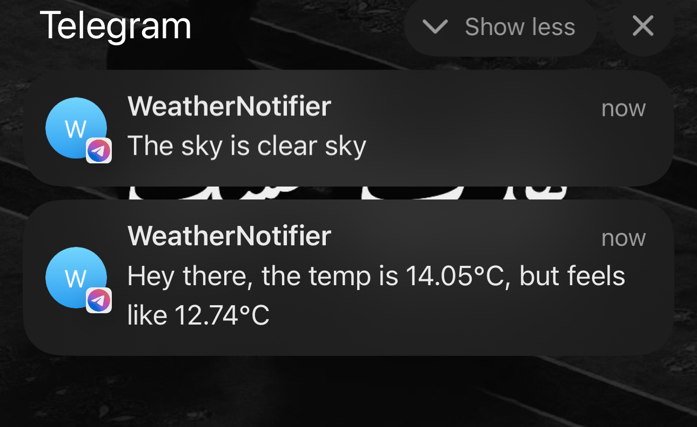

# Weather Notifier
----
This is a simple script I wrote, trying out python scripting and automation.
My aim is to understand how to work with APIS in python and how to work with telegram BOT.

### What is the script actually doing?
- it gets the current location (Lattiude and Longtitude) using geocoder.
- fetch the weather of the location using OpenWeather API
- preparing the information needed to be sent via message
- Send a post request to Telegram BOT api to my bot, to send me a message with information like, temprture, feels like and the description of the weather.

### Work other than Script
- I created an account on OpenWeather to get the API_TOKEN
- Used BotFather on telegram to create my own bot there.
- Used Task Schedualer on PowerShell terminal to setup an automated task that runs the task from my WSL environment.

### Sample Output

### Overall
a pretty simple and fun projects That actually excites for more :P
